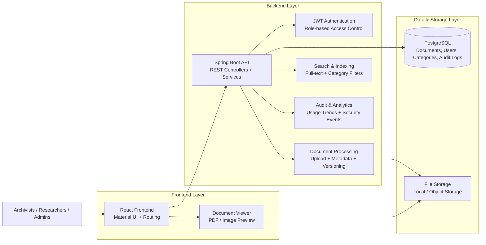

# Digital Archive Management System 📚

A comprehensive document digitization and archive management system built with Java Spring Boot, React, and PostgreSQL.

<p align="center">
  
  
  
  
</p>

## 🌟 Overview

The Digital Archive Management System is designed to help organizations preserve, organize, search, and manage historical and administrative documents efficiently. It supports end-to-end document workflows, from upload and metadata tagging to secure access control and long-term preservation.

This project is especially well-suited for:
- 📜 Presidential and historical archives
- 🏛️ Institutional document repositories
- 🔬 Research and records management offices
- 🏢 Government and public sector digitization programs

## 🏗️ System Architecture



## 🏛️ Project Structure

```text
digital-archive-management-system/
├── backend/
│   ├── src/main/java/.../
│   │   ├── config/
│   │   ├── security/
│   │   ├── controller/
│   │   ├── service/
│   │   ├── repository/
│   │   ├── entity/
│   │   ├── dto/
│   │   └── exception/
│   ├── src/main/resources/
│   │   └── application.properties
│   └── pom.xml
├── frontend/
│   ├── src/
│   │   ├── api/
│   │   ├── components/
│   │   ├── pages/
│   │   ├── features/
│   │   │   ├── documents/
│   │   │   ├── categories/
│   │   │   └── search/
│   │   ├── hooks/
│   │   └── routes/
│   └── package.json
├── database/
│   └── schema.sql
├── storage/
├── README.md
├── .gitignore
└── LICENSE (optional)
```

## ✨ Core Features

- 📄 Document digitization with PDF and image uploads
- 🏷️ Rich metadata support: title, author, date, category, tags, and description
- 🔎 Full-text document search across titles, descriptions, and authors
- 🌳 Hierarchical category structure for nested organization
- 🔐 Multi-level access control: public, restricted, and classified documents
- 🕘 Version tracking for document revisions and historical changes
- 👁️ Built-in document viewer for browsing uploaded files
- 🏷️ Flexible tagging for cross-cutting categorization
- 📊 Analytics dashboard for document trends and statistics
- 🔄 Support for multiple common document formats

## 🚀 Live Demo

This project is designed to be deployed as a full-stack application with a modern web interface and secure backend API.

A typical live deployment architecture includes:
- Frontend: React app hosted on a static web platform or Kubernetes-ready frontend environment
- Backend: Spring Boot service deployed behind a secure API gateway or managed cloud runtime
- Database: PostgreSQL instance for users, document metadata, access control, and audit logs
- Storage: File system or cloud object storage for scanned documents and uploads

### Demo-ready deployment flow

1. Deploy the PostgreSQL database
2. Configure backend environment variables and database credentials
3. Build and deploy the Spring Boot API
4. Deploy the React frontend
5. Upload sample archive records and validate document search, category filters, and permissions

### Example deployment targets

- Vercel / Netlify for the frontend
- Render / Railway / AWS / Azure / DigitalOcean for the backend
- Supabase / Neon / managed PostgreSQL for the database
- S3-compatible storage or local mounted storage for digital files

> Replace the deployment URLs below with your actual hosting configuration when you publish the demo:
>
> - Frontend Demo: https://your-frontend-demo-url.com
> - API Demo: https://your-backend-demo-url.com/api
> - Admin Login: admin@archive.local / Admin@123

## 🧰 Tech Stack

### Backend
- Java 17+
- Spring Boot 3.2.0
- Spring Security with JWT authentication
- Spring Data JPA
- PostgreSQL with full-text search
- Maven

### Frontend
- React 18
- Material UI (planned)
- PDF.js for document viewing
- Axios
- React Router

### Storage
- Local file system storage
- Multipart upload support (up to 50MB)

## 🏆 Why This Project Stands Out

✅ Built specifically for presidential and historical archive workflows

✅ Advanced metadata handling for archival cataloging

✅ Strong search and discovery capabilities for researchers and administrators

✅ Multi-level access control for secure and sensitive document management

✅ Version control to preserve document history and accountability

✅ Scalable, modular architecture with clear separation of concerns

✅ Production-focused design with validation, security, and structured APIs

## ⚙️ Setup Instructions

### Prerequisites

- Java 17 or higher
- PostgreSQL 12+
- Maven 3.6+
- Node.js 16+ for frontend development

### 1) Backend Setup

1. Create the PostgreSQL database:

```bash
createdb archive_db
```

2. Run the schema:

```bash
psql -d archive_db -f database/schema.sql
```

3. Update database credentials in `backend/src/main/resources/application.properties`.

4. Build and run the backend server:

```bash
mvn clean install
mvn spring-boot:run
```

The API will be available at:

```text
http://localhost:8080
```

### 2) Frontend Setup

1. Navigate to the frontend directory:

```bash
cd frontend
```

2. Install dependencies:

```bash
npm install
```

3. Start the development server:

```bash
npm run dev
```

The application will run at:

```text
http://localhost:5173
```

## 🔌 API Endpoints

### Authentication
- `POST /api/auth/register` — Register a new user
- `POST /api/auth/login` — Login and receive a JWT token

### Documents
- `GET /api/documents` — Get all documents
- `GET /api/documents/{id}` — Get a document by ID
- `POST /api/documents/upload` — Upload a document
- `PUT /api/documents/{id}` — Update document metadata
- `DELETE /api/documents/{id}` — Delete a document
- `GET /api/documents/search?keyword={keyword}` — Search documents
- `GET /api/documents/category/{categoryId}` — Get documents by category

### Categories
- `GET /api/categories` — Get all categories
- `POST /api/categories` — Create a new category

## 🏛️ Key Features for Presidential Archives

1. Historical document management for archival collections
2. Standardized metadata capture for cataloging and preservation
3. Access-level management for public, restricted, and classified materials
4. Search and discovery tools for researchers and analysts
5. Preservation-focused versioning to retain change history
6. Scalability for large digital collections and long-term storage

## 🚀 Future Enhancements

- OCR integration for scanned image text extraction
- Multi-language support (Kazakh, Russian, English)
- Workflow management: Draft → Review → Approved
- Timeline visualization for historical documents
- QR code generation for physical archive tracking
- Bulk import/export support
- Advanced analytics and reporting

## 📌 Notes

This project demonstrates a strong foundation for a modern digital archive platform and is suitable as both a demonstration system and a base for further enterprise-grade enhancements.

---

If you want, I can also make this README even more premium by adding:
- a license badge
- a screenshot section
- a contributor section
- a live demo section
- a better architecture diagram
